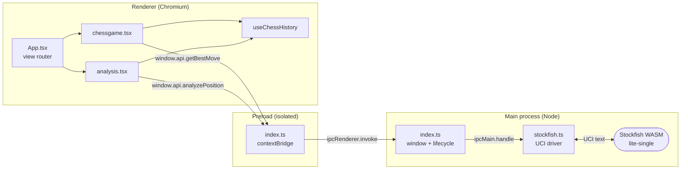

# Architecture

How ChessTactix is put together, and why. This is the document to read before
changing anything that crosses a process boundary or touches the engine.

- [The process model](#the-process-model)
- [The two TypeScript programs](#the-two-typescript-programs)
- [The IPC surface](#the-ipc-surface)
- [The engine](#the-engine)
- [The strength ladder](#the-strength-ladder)
- [Renderer state](#renderer-state)
- [Evaluation and display](#evaluation-and-display)
- [Layout and sizing](#layout-and-sizing)
- [Packaging concerns](#packaging-concerns)

## The process model

Electron gives us three execution contexts, and the split here is driven by one
hard constraint: **the Stockfish package is a Node module, so it can only run in
the main process.** Everything else follows from that.



The renderer never touches Node, `ipcRenderer`, or the engine directly. It gets
exactly two functions, both on `window.api`, both returning promises.

Context isolation is on and `nodeIntegration` is off — the renderer runs as an
ordinary web page. `sandbox: false` is set in
[src/main/index.ts](../src/main/index.ts) because the preload script needs the
`@electron-toolkit/preload` module, which a fully sandboxed preload cannot
require.

External links are handled by `setWindowOpenHandler`, which denies in-app
navigation and hands the URL to `shell.openExternal`. This is what makes the
`mailto:` contact link in the header open the user's mail client rather than a
blank Electron window.

## The two TypeScript programs

`tsconfig.json` is a solution file with no sources of its own. It references two
real programs:

| Program | Config               | Includes                                                  |
| ------- | -------------------- | --------------------------------------------------------- |
| Node    | `tsconfig.node.json` | `electron.vite.config.*`, `src/main/**`, `src/preload/**` |
| Web     | `tsconfig.web.json`  | `src/renderer/src/**`, plus `src/preload/*.d.ts`          |

They do not overlap, and neither can import from the other's sources. That is
deliberate — the renderer must not be able to reach into main-process code — but
it has one consequence worth knowing about before you "fix" it:

> [!IMPORTANT]
> `StrengthLevel` and `EngineLine` are **defined three times**, in
> [src/main/stockfish.ts](../src/main/stockfish.ts),
> [src/preload/index.d.ts](../src/preload/index.d.ts), and
> [src/renderer/src/types.ts](../src/renderer/src/types.ts). This is not
> accidental duplication. The three definitions must be changed together; each
> carries a comment naming the other two.

The one type that _does_ cross the boundary is the ambient `Window` declaration
in `src/preload/index.d.ts`, which the web program pulls in explicitly. That is
how the renderer knows `window.api` exists and what its signatures are.

Renderer sources can also be imported through the `@renderer/*` alias, mapped in
both `tsconfig.web.json` and [electron.vite.config.ts](../electron.vite.config.ts).

## The IPC surface

Two channels, both request/response via `invoke`/`handle`:

| Channel                 | Renderer call                                     | Returns                                                                      |
| ----------------------- | ------------------------------------------------- | ---------------------------------------------------------------------------- |
| `chess:getBestMove`     | `window.api.getBestMove(fen, level)`              | UCI move string (`"e2e4"`, `"e7e8q"`), or `null` if there are no legal moves |
| `chess:analyzePosition` | `window.api.analyzePosition(fen, multiPv, depth)` | `EngineLine[]`, best line first                                              |

Positions cross as FEN strings and moves as UCI strings. Nothing structured is
serialised, so there is no shared object model to keep in sync between the
processes — the whole contract is four primitives and one flat array.

To add a channel: register the handler in `app.whenReady()` in
[src/main/index.ts](../src/main/index.ts), add the wrapper to the `api` object in
[src/preload/index.ts](../src/preload/index.ts), and add its signature to the
`Api` type in [src/preload/index.d.ts](../src/preload/index.d.ts). Miss the third
step and the call works at runtime but does not typecheck.

## The engine

[src/main/stockfish.ts](../src/main/stockfish.ts) is the only file that speaks
UCI. Three things about it matter:

**One instance, created lazily.** Loading the WASM engine has real startup cost,
so `getEngine()` memoises a single instance in `enginePromise` for the app's
lifetime. `initEngine()` performs the standard handshake — send `uci`, wait for
`uciok`, send `isready`, wait for `readyok` — before resolving.

**All requests are serialised.** The `stockfish` binding exposes exactly one
`listener` slot. Two concurrent searches would overwrite each other's callback
and both would hang or resolve with the wrong result. A module-level `queue`
promise chains every request end to end:

```ts
const result = queue.then(() => requestBestMove(fen, level))
queue = result.catch(() => undefined) // a failed request must not stall the chain
```

The `.catch()` is load-bearing: without it, one rejected search would poison the
queue and every later request would reject too.

**Every option is restated on every search.** UCI options are sticky on a reused
engine instance. A search that assumed the previous caller's settings would
inherit them, which produces two specific bugs this code exists to prevent:

- Analysis after a game against a 1200-rated opponent would quietly evaluate at
  1200 strength. `requestAnalysis()` therefore calls `applyStrength()` with the
  full-strength preset every time, regardless of what the game was set to.
- `MultiPV` left at 3 would make the AI opponent pay for a three-line search it
  never asked for, so `requestAnalysis()` resets it to 1 once the search
  completes.

**Parsing.** `waitForBestMove()` matches `^bestmove (\S+)` and maps `(none)` to
`null`. `requestAnalysis()` accumulates `info ... pv ...` lines into a
`Map<multipv, EngineLine>` — keyed by rank so later, deeper reports for a line
replace earlier shallow ones — and resolves on `bestmove`. Progress-only `info`
lines with no `pv` are ignored.

## The strength ladder

Eight rungs, built from two different mechanisms because neither one covers the
whole range.

| Level | Elo   | Mechanism                            | Depth |
| ----- | ----- | ------------------------------------ | ----- |
| 1     | ~800  | `Skill Level 0`                      | 1     |
| 2     | ~1000 | `Skill Level 2`                      | 2     |
| 3     | ~1200 | `Skill Level 4`                      | 3     |
| 4     | 1500  | `UCI_LimitStrength` + `UCI_Elo 1500` | 16    |
| 5     | 1800  | `UCI_LimitStrength` + `UCI_Elo 1800` | 16    |
| 6     | 2100  | `UCI_LimitStrength` + `UCI_Elo 2100` | 16    |
| 7     | 2500  | `UCI_LimitStrength` + `UCI_Elo 2500` | 16    |
| 8     | ~3190 | unrestricted, `Skill Level 20`       | 16    |

`UCI_LimitStrength` is Stockfish's own calibrated handicap, so levels 4–7 carry
ratings the engine authors stand behind. But it bottoms out at **1320**, which is
still well above a beginner. Levels 1–3 therefore use `Skill Level` plus a very
shallow depth cap, and their Elo figures are our estimates — which is why the UI
presents the whole scale as approximate.

`depth` is always set. An unbounded `go` has no time control to stop it and would
search until interrupted.

> [!IMPORTANT]
> The ladder is defined twice: `STRENGTH_PRESETS` in
> [src/main/stockfish.ts](../src/main/stockfish.ts) holds what the engine needs,
> and `STRENGTH_LEVELS` in
> [src/renderer/src/utils/strength.ts](../src/renderer/src/utils/strength.ts)
> holds the Elo and display name the UI shows. The two live in different
> TypeScript programs and cannot import each other. Change one, change the other.

## Renderer state

[App.tsx](../src/renderer/src/App.tsx) is a four-way view switch — `landing`,
`setup`, `ai`, `analysis` — holding one piece of cross-screen state, the
`AiOptions` chosen during setup. There is no router and no store.

The substantive state lives in
[useChessHistory](../src/renderer/src/hooks/useChessHistory.ts), shared verbatim
by the play and analysis screens. Its model is a linear array of FEN strings, one
per ply and starting with the initial position, plus a `viewIndex` pointer into
it:

```
history:  [ start, after 1.e4, after 1...e5, after 2.Nf3 ]
viewIndex:                ^ 1  -- the board shows this position
```

- `position` is `history[viewIndex]` — always render-safe to read, unlike a ref.
- Navigation moves the pointer and loses nothing.
- `pushMove` truncates everything after `viewIndex` and appends, so playing from
  a position you navigated back to branches from there. Text-editor undo/redo.
- `moveHistory` holds SAN per ply and is kept exactly `history.length - 1` long.
- Arrow keys are bound at the window, and ignored while focus is in an input.

A single `Chess` instance is held in a ref and reloaded from `position` in an
effect, so move generation always reflects what is on screen rather than the
live game's end state. Callers that need to query a position independently build
their own throwaway `new Chess(position)`.

`navigationEnabled` is the safety interlock: `chessgame.tsx` passes `false` while
an engine request is in flight, so the user cannot navigate the board out from
under a move that is about to arrive.

### The two board screens

Both compose the same parts — `BoardLayout`, `BoardControls`, `MoveHistory`,
`PromotionDialog`, `useChessHistory`, `useBoardScale` — and differ only in what
fills the right rail and what they do after a move.

|                    | `chessgame.tsx`                                                         | `analysis.tsx`                                      |
| ------------------ | ----------------------------------------------------------------------- | --------------------------------------------------- |
| Right rail         | `GameInfoPanel` — captures, material, opponent                          | `EnginePanel` — eval bar, candidate lines           |
| After a move       | Request one best move at the game's level, play it after a 300 ms delay | Re-run a 3-line depth-16 search on the new position |
| Board arrows       | none                                                                    | Best line, plus alternatives within 50 cp           |
| Destructive action | "New Game" → back to setup                                              | "Reset Board"                                       |

The AI delay is cosmetic — an instant reply reads as a bug rather than as an
opponent.

## Evaluation and display

[utils/engine.ts](../src/renderer/src/utils/engine.ts) turns raw UCI scores into
things a human can read. Two conventions collide here and the file exists to
reconcile them:

**UCI reports scores relative to the side to move. Chess convention states them
from White's perspective.** So `formatEvaluation()` and `whiteShare()` both take
`sideToMove` and flip the sign on Black's turn. Forgetting this flip is the
easiest bug to introduce in this area, and it is invisible on White's move.

- `comparableScore()` collapses centipawn and mate scores onto one sortable
  number by pushing mates outside the centipawn range (`±(100000 - |mate|)`), so
  a forced mate always outranks a good centipawn score and a shorter mate
  outranks a longer one.
- `whiteShare()` maps an evaluation onto the 0–1 fill of the eval bar through the
  standard logistic `1 / (1 + 10^(-cp/400))`. A linear scale would peg the bar at
  one end almost immediately; this one moves a lot near equality and saturates
  gently once a position is decided.
- `pvToSan()` replays a UCI move list against a scratch `Chess` instance to
  produce numbered SAN (`"12. e4 e5 13. Nf3"`, or `"12... Nf6"` if the line
  starts on Black's move), capped at 12 plies and stopping cleanly at the first
  move that fails to apply.

[utils/material.ts](../src/renderer/src/utils/material.ts) derives captures
purely from the position — counting what is missing against the starting counts —
rather than from the move list. That is what lets the capture tray stay correct
for any FEN, including one you navigated back to. Counts are clamped at zero
because promotion can leave a side with _more_ of a piece than it started with.

## Layout and sizing

The board is sized from **measured space**, not viewport math.
[useElementSize](../src/renderer/src/hooks/useElementSize.ts) reads the content
box synchronously in `useLayoutEffect` — so the first painted frame is already
correct rather than flashing — then keeps it current with a `ResizeObserver`.

[BoardLayout](../src/renderer/src/components/boardlayout.tsx) gives the two rails
a bounded share of the width (17%, clamped between 176 and 256 px, with a 132 px
floor) and hands the board whatever is left. The rails give up width before the
board does.

Two details are easy to break:

- `main` carries `min-h-0` on the board views. Without it, a flex item's
  automatic minimum height is its content, so a board sized from measured height
  would hold its own space open and never shrink when the window got shorter.
- [useBoardScale](../src/renderer/src/hooks/useBoardScale.ts) persists the user's
  board-size preference to `localStorage` behind try/catch. In a packaged build
  the renderer loads from `file://`, where storage can be unavailable — a board
  that forgets its size is a far better failure than a screen that does not
  render.

The scale slider ranges 0.5–1.0 of the largest board that fits, so it can only
ever scale _down_ from the fit and can never push the board off screen.

Every side-rail section is built from
[Panel](../src/renderer/src/components/panel.tsx) — a tracked-out label over a
hairline rule, no card, no border box — so both screens read as one surface.

## Packaging concerns

Documented fully in [RELEASING.md](RELEASING.md); the parts that constrain the
code:

**The engine must stay outside the asar archive.** The `.wasm` is loaded from a
real filesystem path at runtime, so `node_modules/stockfish/bin/**` and
`resources/**` are listed under `asarUnpack` in
[electron-builder.yml](../electron-builder.yml).

**Only one engine build ships.** The `stockfish` package contains five builds
totalling ~240 MB. The `files` list drops `node_modules/stockfish/bin/**` and
re-includes only `*-lite-single.{js,wasm}`. Patterns are last-match-wins, so the
re-include must follow the exclusion. If you ever change the argument to
`stockfish(...)` in `src/main/stockfish.ts`, this filter must change with it or
the packaged app will fail to start while the dev build works fine.

**`lite-single` is a deliberate choice.** The multi-threaded builds need
`worker_threads` and `SharedArrayBuffer` plumbing; the single-threaded lite build
avoids all of it, at some cost in strength that does not matter for a casual
opponent.

**`npmRebuild: false`** is safe precisely because the engine is WebAssembly.
There are no native modules to rebuild against Electron's headers. Adding a
native dependency would mean revisiting that flag.
