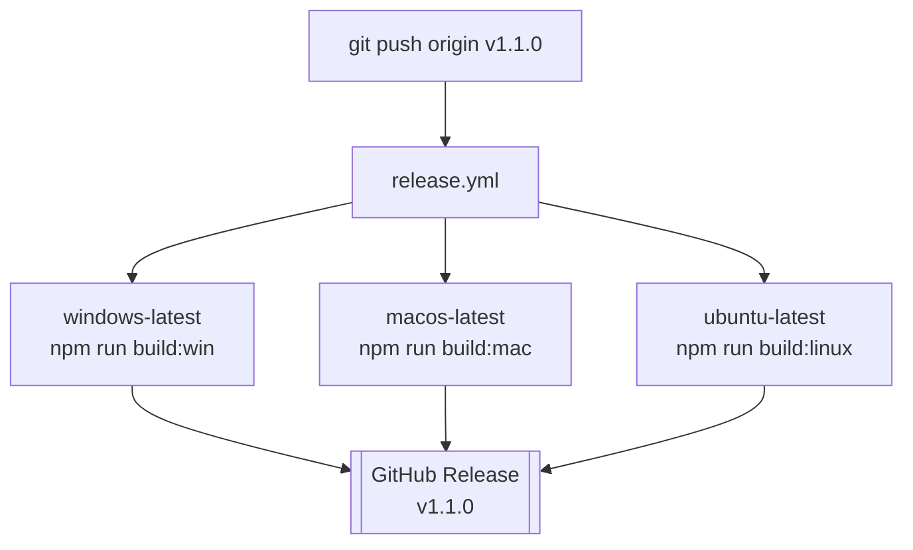

# Releasing

How a ChessTactix version gets from the repository to an installer someone can
download.

- [The short version](#the-short-version)
- [Why CI builds all three](#why-ci-builds-all-three)
- [Building locally](#building-locally)
- [What each target produces](#what-each-target-produces)
- [Code signing](#code-signing)
- [Version numbering](#version-numbering)
- [Troubleshooting](#troubleshooting)

## The short version

```bash
# 1. Make sure the tree is clean and the checks pass
npm run typecheck
npm run lint

# 2. Bump the version and move the CHANGELOG's Unreleased entries into it
#    (npm version writes package.json, commits, and creates the tag)
npm version minor -m "Release v%s"

# 3. Push the commit and the tag
git push origin main --follow-tags
```

Pushing the tag is what triggers everything else.
[.github/workflows/release.yml](../.github/workflows/release.yml) matches
`tags: ['v*']`, fans out across three runners, and uploads the resulting
installers to the GitHub release for that tag.

To rehearse the build without cutting a release, run the workflow manually from
the Actions tab. `workflow_dispatch` runs the identical matrix with
`--publish never`, so you get the installers as workflow artifacts and no
release is touched.

## Why CI builds all three

Each installer must be produced on the operating system it targets. A `.dmg`
requires macOS tooling, the Linux targets need Linux tooling, and NSIS is built
on Windows. There is no way around this from a single machine, which is the
entire reason the release workflow exists as a three-runner matrix rather than a
script you could run locally.



`fail-fast: false` is set deliberately: if the macOS leg fails, the Windows and
Linux installers should still be published rather than being cancelled alongside
it.

## Building locally

Useful when you want to test the packaged app rather than ship it.

```bash
npm run build:unpack   # dist/win-unpacked/ -- runnable, no installer, fastest
npm run build:win      # dist/ChessTactix-<version>-setup.exe
npm run build:mac      # dist/ChessTactix-<version>-<arch>.dmg + .zip
npm run build:linux    # dist/ChessTactix-<version>-<arch>.AppImage + .deb
```

Each of these runs `npm run build` first, which typechecks both TypeScript
programs and then compiles the main, preload, and renderer bundles into `out/`.
A type error stops the build before packaging starts.

> [!TIP]
> `build:unpack` is almost always the right one for testing a change to
> packaging behaviour. It skips installer generation entirely, and problems like
> the engine `.wasm` not being found show up just as clearly.

## What each target produces

| Target | Artifact | Details |
| --- | --- | --- |
| `nsis` | `ChessTactix-<version>-setup.exe` | Wizard, not one-click. Per-user (`perMachine: false`) so there is no UAC prompt. Creates desktop and Start Menu shortcuts, registers an uninstaller under Apps & features, and displays [build/license.txt](../build/license.txt) during setup. |
| `dmg` / `zip` | `ChessTactix-<version>-<arch>.dmg` | Built for both `arm64` and `x64`. `notarize: false`. |
| `AppImage` | `ChessTactix-<version>-<arch>.AppImage` | Portable single file; `chmod +x` and run. |
| `deb` | `ChessTactix-<version>-<arch>.deb` | Category `Game`, with desktop-entry keywords for chess. |

Publishing goes to the `klaywork2005/chesstactix` GitHub repository, configured
under `publish:` in [electron-builder.yml](../electron-builder.yml).

## Code signing

Nothing is currently signed. The consequences are user-visible and should stay
documented in the README until they change:

- **Windows** — SmartScreen shows "Windows protected your PC" on first run.
  Users must choose *More info → Run anyway*. Reputation accrues per-certificate,
  so an unsigned build never stops warning.
- **macOS** — Gatekeeper refuses to open the app on first launch. Users must
  right-click and choose *Open*. `notarize: false` is set for the same reason.

CI sets `CSC_IDENTITY_AUTO_DISCOVERY: false`. Without it, electron-builder
searches for a signing identity on the macOS runner, fails to find one, and
errors out instead of producing an unsigned app.

To start signing, provide the certificate to CI as secrets and remove that
environment variable:

| Platform | Secrets | electron-builder reads |
| --- | --- | --- |
| Windows | `WIN_CSC_LINK` (base64 `.pfx`), `WIN_CSC_KEY_PASSWORD` | automatically |
| macOS | `CSC_LINK` (base64 `.p12`), `CSC_KEY_PASSWORD`, plus `APPLE_ID`, `APPLE_APP_SPECIFIC_PASSWORD`, `APPLE_TEAM_ID` for notarisation | automatically; set `notarize: true` |

> [!CAUTION]
> Certificates and their passwords must never be committed. `.gitignore` blocks
> `*.p12`, `*.pfx`, and `*.mobileprovision` as a backstop, but the real rule is
> that they only ever exist as repository secrets.

## Version numbering

The version in [package.json](../package.json) is the single source of truth.
electron-builder interpolates it into every artifact name (`${version}`) and into
the NSIS uninstall entry, and the release workflow keys off the tag that matches
it.

Follow [Semantic Versioning](https://semver.org/):

- **patch** — bug fixes, no behaviour change users would notice
- **minor** — new features, backwards compatible
- **major** — changes that break a user's existing setup

Keep the tag and `package.json` in step. `npm version` does this for you; editing
`package.json` by hand and tagging separately is how they drift.

## Troubleshooting

**The packaged app starts but the engine never responds.** Almost always the
electron-builder `files` filter. The `stockfish` package ships five engine builds
and all but `lite-single` are excluded; if the argument to `stockfish(...)` in
[src/main/stockfish.ts](../src/main/stockfish.ts) changed without the filter
changing to match, the dev build works and the packaged one cannot find its
`.wasm`. See
[ARCHITECTURE.md](ARCHITECTURE.md#packaging-concerns).

**`if-no-files-found: error` failed the upload step.** The build produced no
artifact matching the expected glob — read the build step's log above it rather
than the upload failure, which is only the symptom.

**The release exists but has no assets.** Check that the run was triggered by a
tag push. A `workflow_dispatch` run passes `--publish never` by design and
uploads only to the workflow's own artifacts.

**macOS build fails looking for a signing identity.** `CSC_IDENTITY_AUTO_DISCOVERY`
is not set to `false` for that step.
